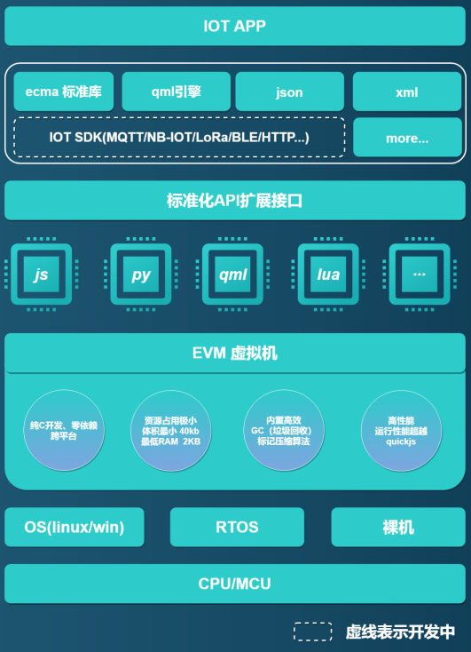

# EVM 超轻量物联网虚拟机

##  1.  EVM 是什么

 **`EVM`** 全称 `Embedded Virtural Machine`，本质上是一款通用、精简的嵌入式虚拟机，由语法解析前端框架和字节码运行后端构成，可运行在资源受限制的单片机上。

---

## 2. 仓库地址

 + GIthub 地址： https://github.com/scriptiot/evm
 + Gitee  地址： https://gitee.com/scriptiot/evm

---

## 3. EVM 技术架构

---

## 4. EVM 优势特点

+ 纯C开发、零依赖、跨平台、内置REPL；
+ 最小编译体积40KB，最小内存占用2KB;
+ 支持多语言混合开发，目前支持Javascript、Python、Lua、QML、Json、XML等语言;
+ 先进的内存管理，无内存泄露和内存碎片问题;
+ 高效的运行性能，性能媲美QuickJs;
+ 灵活的虚拟机扩展技术，多语言可共享扩展功能;

---

## 5. EVM愿景

> `万物互联，因我们而简单`

打破物联网和互联网人才边界，赋能物联网企业和开发者全新的开发模式，降低物联网开发门槛，极速提升开发效率。

---

## 6. EVM问卷调查

> **欢迎大家投票，选出你最喜欢的物联网开发语言， EVM团队会优先支持!**

[EVM支持多语言开发物联网，你最希望支持的语言是哪一种语言?](https://www.wenjuan.com/s/Qre6Vf/)

---

## 7. 贡献代码

+ 在您自己的GitHub账户下Fork **`EVM`** 开源项目；
+ 根据您的需求在本地clone 一份 **`EVM`** 代码；
+ 您修改或者新增功能后，push 到您fork的远程分支；
+ 创建 pull request，向 **`EVM`** 官方开发分支提交合入请求；
+ **`EVM`** 研发团队会定期review代码，通过测试后合入。

---

## 8. 加入EVM官方QQ技术交流群

> 群号：**`399011436`**

---

## 9.联系我们

+ 论坛： [EVM官方技术交流论坛](http://forum.evmiot.com/)
+ 邮箱： scriptiot@aliyun.com

欢迎大家通过 `GitHub issues`、`邮件` `论坛` 或 `QQ群`反馈问题和联系我们。
