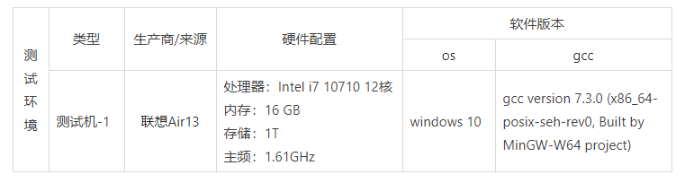

# EVM 虚拟机全面测评

# 1. EVM Flash/SRAM体积占用测试

## 1.1 测试目的

评测EVM FLASH及SRAM占用情况

## 1.2 测试环境


## 1.3 测试步骤

1. 程序内不加载EVM

```
Linking C executable zephyr\zephyr_prebuilt.elf                                               
Memory region         Used Size  Region Size  %age Used                                             
           FLASH:       14016 B       256 KB      5.35%                                             
            SRAM:        7408 B        64 KB     11.30%                                             
        IDT_LIST:         168 B         2 KB      8.20%                                              |
```


2. 加载EVM，不使能外设及ECMA等拓展功能

```
Linking C executable zephyr\zephyr_prebuilt.elf                                           
Memory region         Used Size  Region Size  %age Used                                             
           FLASH:       84696 B       256 KB     32.31%                                             
            SRAM:        8392 B        64 KB     12.81%                                             
        IDT_LIST:         168 B         2 KB      8.20%                                              |
```


3. 加载完整版EVM

```
Linking C executable zephyr\zephyr_prebuilt.elf                                           
Memory region         Used Size  Region Size  %age Used                                             
           FLASH:      127232 B       256 KB     48.54%                                             
            SRAM:       38472 B        64 KB     58.70%                                             
        IDT_LIST:         184 B         2 KB      8.98%                                              |
```


# 2. EVM 启动heap和stack占用测试
## 2.1 测试环境


## 2.2 测试步骤


1、EVM启动完成，启用内置函数show()，读取当前heap 及 stack
2、执行以下脚本后，再次读取堆栈值
```javascript
var m =require('evm');print("hello world");show();
```
3、重复步骤2十次


## 2.3 测试结果
由步骤1可知启动EVM后，占用heap 1712B，计算每次运行步骤2后堆栈值如下：


| 次数 | heap | stack | 递增值 |
| --- | --- | --- | --- |
| 1 | 1832 | 0 | 120 |
| 2 | 1952 | 0 | 120 |
| 3 | 2072 | 0 | 120 |
| 4 | 2192 | 0 | 120 |
| 5 | 2312 | 0 | 120 |
| 6 | 2432 | 0 | 120 |
| 7 | 2552 | 0 | 120 |
| 8 | 2672 | 0 | 120 |
| 9 | 2792 | 0 | 120 |
| 10 | 2912 | 0 | 120 |

```javascript
>>> *** Booting Zephyr OS build v2.3.0-rc1-231-gbfb56c5e20a8  ***▒
 _____ __     __ __  __
| ____|\ \   / /|  \/  |
|  _|   \ \ / / | |\/| |
| |___   \ V /  | |  | |
|_____|   \_/   |_|  |_|
Github: https://github.com/scriptiot/evm
Copyright (C) 2020 @scriptiot
>>> show()
heap   memory usage = 1712 bytes
stack  memory usage = 0 bytes
>>> var m =require('evm');print("hello world");show();
hello world
heap   memory usage = 1832 bytes
stack  memory usage = 0 bytes
>>> var m =require('evm');print("hello world");show();
hello world
heap   memory usage = 1952 bytes
stack  memory usage = 0 bytes
>>> var m =require('evm');print("hello world");show();
hello world
heap   memory usage = 2072 bytes
stack  memory usage = 0 bytes
>>> var m =require('evm');print("hello world");show();
hello world
heap   memory usage = 2192 bytes
stack  memory usage = 0 bytes
>>> var m =require('evm');print("hello world");show();
hello world
heap   memory usage = 2312 bytes
stack  memory usage = 0 bytes
>>> var m =require('evm');print("hello world");show();
hello world
heap   memory usage = 2432 bytes
stack  memory usage = 0 bytes
>>> var m =require('evm');print("hello world");show();
hello world
heap   memory usage = 2552 bytes
stack  memory usage = 0 bytes
>>> var m =require('evm');print("hello world");show();
hello world
heap   memory usage = 2672 bytes
stack  memory usage = 0 bytes
>>> var m =require('evm');print("hello world");show();
hello world
heap   memory usage = 2792 bytes
stack  memory usage = 0 bytes
>>> var m =require('evm');print("hello world");show();
hello world
heap   memory usage = 2912 bytes
stack  memory usage = 0 bytes
>>>
```

# 3. EVM 启动js脚本加载时间测试
## 3.1 测试环境


## 3.2 测试步骤

1. 复位设备
1. repl发送脚本
1. MCU读取接收完成时间戳
1. 脚本执行前后读取时间戳
1. 重复以上步骤10次


代码如下：
```javascript
var m =require('evm');
var t1 = m.systick_ns();
print("hello world");
print("start:",t1," end:",m.systick_ns());
```
## 3.3 测试结果


加载时间减去串口发送rec clock:XXXXXXXXXX 的时间：1916200`ns`


| 次数 | 接收时间`ns` | 开始时间`ns` | 结束时间`ns` | 加载时间`ns` | 执行时间`ns` |
| --- | --- | --- | --- | --- | --- |
| 1 | 1866390129 | 1872602516 | 1873763866 | 4296187 | 1161350 |
| 2 | 2091331187 | 2097542237 | 2098702612 | 4294850 | 1160375 |
| 3 | 1284066887 | 1290277937 | 1291437637 | 4294850 | 1159700 |
| 4 | 1806365512 | 1812576962 | 1813737325 | 4295250 | 1160363 |
| 5 | 1382629062 | 1388840100 | 1389999787 | 4294838 | 1159687 |
| 6 | 1482288000 | 1488499312 | 1489659500 | 4295112 | 1160188 |
| 7 | 2122605112 | 2128816137 | 2129975837 | 4294825 | 1159700 |
| 8 | 1482508700 | 1488719725 | 1489879425 | 4294825 | 1159700 |
| 9 | 1253350337 | 1259561600 | 1260721300 | 4295063 | 1159700 |
| 10 | 1265612987 | 1271824275 | 1272983975 | 4295088 | 1159700 |


```shell
>>> *** Booting Zephyr OS build v2.3.0-rc1-231-gbfb56c5e20a8  ***▒
 _____ __     __ __  __
| ____|\ \   / /|  \/  |
|  _|   \ \ / / | |\/| |
| |___   \ V /  | |  | |
|_____|   \_/   |_|  |_|
Github: https://github.com/scriptiot/evm
Copyright (C) 2020 @scriptiot
>>> var m =require('evm');var t1 = m.systick_ns();print("hello world");print("start:",t1," end:",m.systick_ns());
rec clock:1866390129
hello world
start: 1872602516  end: 1873763866
*** Booting Zephyr OS build v2.3.0-rc1-231-gbfb56c5e20a8  ***▒
 _____ __     __ __  __
| ____|\ \   / /|  \/  |
|  _|   \ \ / / | |\/| |
| |___   \ V /  | |  | |
|_____|   \_/   |_|  |_|
Github: https://github.com/scriptiot/evm
Copyright (C) 2020 @scriptiot
>>> var m =require('evm');var t1 = m.systick_ns();print("hello world");print("start:",t1," end:",m.systick_ns());
rec clock:2091331187
hello world
start: 2097542237  end: 2098702612
>>> *** Booting Zephyr OS build v2.3.0-rc1-231-gbfb56c5e20a8  ***▒
 _____ __     __ __  __
| ____|\ \   / /|  \/  |
|  _|   \ \ / / | |\/| |
| |___   \ V /  | |  | |
|_____|   \_/   |_|  |_|
Github: https://github.com/scriptiot/evm
Copyright (C) 2020 @scriptiot
>>> var m =require('evm');var t1 = m.systick_ns();print("hello world");print("start:",t1," end:",m.systick_ns());
rec clock:1284066887
hello world
start: 1290277937  end: 1291437637
>>> *** Booting Zephyr OS build v2.3.0-rc1-231-gbfb56c5e20a8  ***▒
 _____ __     __ __  __
| ____|\ \   / /|  \/  |
|  _|   \ \ / / | |\/| |
| |___   \ V /  | |  | |
|_____|   \_/   |_|  |_|
Github: https://github.com/scriptiot/evm
Copyright (C) 2020 @scriptiot
>>> var m =require('evm');var t1 = m.systick_ns();print("hello world");print("start:",t1," end:",m.systick_ns());
rec clock:1806365512
hello world
start: 1812576962  end: 1813737325
*** Booting Zephyr OS build v2.3.0-rc1-231-gbfb56c5e20a8  ***▒
 _____ __     __ __  __
| ____|\ \   / /|  \/  |
|  _|   \ \ / / | |\/| |
| |___   \ V /  | |  | |
|_____|   \_/   |_|  |_|
Github: https://github.com/scriptiot/evm
Copyright (C) 2020 @scriptiot
>>> var m =require('evm');var t1 = m.systick_ns();print("hello world");print("start:",t1," end:",m.systick_ns());
rec clock:1382629062
hello world
start: 1388840100  end: 1389999787
>>> *** Booting Zephyr OS build v2.3.0-rc1-231-gbfb56c5e20a8  ***▒
 _____ __     __ __  __
| ____|\ \   / /|  \/  |
|  _|   \ \ / / | |\/| |
| |___   \ V /  | |  | |
|_____|   \_/   |_|  |_|
Github: https://github.com/scriptiot/evm
Copyright (C) 2020 @scriptiot
>>> var m =require('evm');var t1 = m.systick_ns();print("hello world");print("start:",t1," end:",m.systick_ns());
rec clock:1482288000
hello world
start: 1488499312  end: 1489659500
>>> *** Booting Zephyr OS build v2.3.0-rc1-231-gbfb56c5e20a8  ***▒
 _____ __     __ __  __
| ____|\ \   / /|  \/  |
|  _|   \ \ / / | |\/| |
| |___   \ V /  | |  | |
|_____|   \_/   |_|  |_|
Github: https://github.com/scriptiot/evm
Copyright (C) 2020 @scriptiot
>>> var m =require('evm');var t1 = m.systick_ns();print("hello world");print("start:",t1," end:",m.systick_ns());
rec clock:2122605112
hello world
start: 2128816137  end: 2129975837
>>> *** Booting Zephyr OS build v2.3.0-rc1-231-gbfb56c5e20a8  ***▒
 _____ __     __ __  __
| ____|\ \   / /|  \/  |
|  _|   \ \ / / | |\/| |
| |___   \ V /  | |  | |
|_____|   \_/   |_|  |_|
Github: https://github.com/scriptiot/evm
Copyright (C) 2020 @scriptiot
>>> var m =require('evm');var t1 = m.systick_ns();print("hello world");print("start:",t1," end:",m.systick_ns());
rec clock:1482508700
hello world
start: 1488719725  end: 1489879425
>>> *** Booting Zephyr OS build v2.3.0-rc1-231-gbfb56c5e20a8  ***▒
 _____ __     __ __  __
| ____|\ \   / /|  \/  |
|  _|   \ \ / / | |\/| |
| |___   \ V /  | |  | |
|_____|   \_/   |_|  |_|
Github: https://github.com/scriptiot/evm
Copyright (C) 2020 @scriptiot
>>>
rec clock:1541658675
*** Booting Zephyr OS build v2.3.0-rc1-231-gbfb56c5e20a8  ***▒
 _____ __     __ __  __
| ____|\ \   / /|  \/  |
|  _|   \ \ / / | |\/| |
| |___   \ V /  | |  | |
|_____|   \_/   |_|  |_|
Github: https://github.com/scriptiot/evm
Copyright (C) 2020 @scriptiot
>>> var m =require('evm');var t1 = m.systick_ns();print("hello world");print("start:",t1," end:",m.systick_ns());
rec clock:1253350337
hello world
start: 1259561600  end: 1260721300
>>> *** Booting Zephyr OS build v2.3.0-rc1-231-gbfb56c5e20a8  ***▒
 _____ __     __ __  __
| ____|\ \   / /|  \/  |
|  _|   \ \ / / | |\/| |
| |___   \ V /  | |  | |
|_____|   \_/   |_|  |_|
Github: https://github.com/scriptiot/evm
Copyright (C) 2020 @scriptiot
>>> var m =require('evm');var t1 = m.systick_ns();print("hello world");print("start:",t1," end:",m.systick_ns());
rec clock:1265612987
hello world
start: 1271824275  end: 1272983975
>>>
```

# 4. EVM 扩展C调用性能消耗测试
## 4.1 测试目的

评估EVM函数调用的性能消耗状况
## 4.2 EVM在x86 windows上测试函数调用

### 4.2.1 测试环境




### 
### 4.2.2 测试步骤


- **测试1**： 从100万次函数调用到1000万次函数调用，每次增加100万次，统计函数调用时间
- **测试2：**从1000万次函数调用到10000万次函数调用，每次增加1000万次，统计函数调用时间


### 4.2.3 测试结果


#### 4.2.3.1 测试1
| 函数调用次数（万） | 总共耗时（ms） | 单次调用（us） |
| --- | --- | --- |
| 100 | 45.999954 | 0.045999954 |
| 200 | 90.000101 | 0.0450000505 |
| 300 | 167.000139 | 0.055666713 |
| 400 | 222.999550 | 0.055749888 |
| 500 | 298.000285 | 0.059600057 |
| 600 | 343.000303 | 0.057166717 |
| 700 | 407.999975 | 0.058285711 |
| 800 | 454.999878 | 0.056874985 |
| 900 | 502.999542 | 0.055888838 |
| 1000 | 557.999439 | 0.0557999439 |

2318.997987
```shell
dragondjf@LAPTOP-V8KUBNPK MINGW64 /e/workspace/evmspace/benchmark/evm/src/x86 (master)
$ ../../bin/x86_64_windows_mingw/ejs.exe /e/workspace/evmspace/benchmark/test/evmbench/sum.js
func call times: 1000000
c func call : 2.159000e+003 ms
total call :2.205000e+003 ms
45.999954

dragondjf@LAPTOP-V8KUBNPK MINGW64 /e/workspace/evmspace/benchmark/evm/src/x86 (master)
$ ../../bin/x86_64_windows_mingw/ejs.exe /e/workspace/evmspace/benchmark/test/evmbench/sum.js
func call times: 2000000
c func call : 4.331000e+003 ms
total call :4.421000e+003 ms
90.000101

dragondjf@LAPTOP-V8KUBNPK MINGW64 /e/workspace/evmspace/benchmark/evm/src/x86 (master)
$ ../../bin/x86_64_windows_mingw/ejs.exe /e/workspace/evmspace/benchmark/test/evmbench/sum.js
func call times: 3000000
c func call : 6.464000e+003 ms
total call :6.631000e+003 ms
167.000139

dragondjf@LAPTOP-V8KUBNPK MINGW64 /e/workspace/evmspace/benchmark/evm/src/x86 (master)
$ ../../bin/x86_64_windows_mingw/ejs.exe /e/workspace/evmspace/benchmark/test/evmbench/sum.js
func call times: 4000000
c func call : 8.768000e+003 ms
total call :8.973000e+003 ms
204.999819

dragondjf@LAPTOP-V8KUBNPK MINGW64 /e/workspace/evmspace/benchmark/evm/src/x86 (master)
$ ../../bin/x86_64_windows_mingw/ejs.exe /e/workspace/evmspace/benchmark/test/evmbench/sum.js
func call times: 5000000
c func call : 1.090900e+004 ms
total call :1.120700e+004 ms
298.000285

dragondjf@LAPTOP-V8KUBNPK MINGW64 /e/workspace/evmspace/benchmark/evm/src/x86 (master)
$ ../../bin/x86_64_windows_mingw/ejs.exe /e/workspace/evmspace/benchmark/test/evmbench/sum.js
func call times: 6000000
c func call : 1.314100e+004 ms
total call :1.348400e+004 ms
343.000303

dragondjf@LAPTOP-V8KUBNPK MINGW64 /e/workspace/evmspace/benchmark/evm/src/x86 (master)
$ ../../bin/x86_64_windows_mingw/ejs.exe /e/workspace/evmspace/benchmark/test/evmbench/sum.js
func call times: 7000000
c func call : 1.499500e+004 ms
total call :1.540300e+004 ms
407.999975

dragondjf@LAPTOP-V8KUBNPK MINGW64 /e/workspace/evmspace/benchmark/evm/src/x86 (master)
$ ../../bin/x86_64_windows_mingw/ejs.exe /e/workspace/evmspace/benchmark/test/evmbench/sum.js
func call times: 8000000
c func call : 1.725300e+004 ms
total call :1.770800e+004 ms
454.999878

dragondjf@LAPTOP-V8KUBNPK MINGW64 /e/workspace/evmspace/benchmark/evm/src/x86 (master)
$ ../../bin/x86_64_windows_mingw/ejs.exe /e/workspace/evmspace/benchmark/test/evmbench/sum.js
func call times: 9000000
c func call : 1.965700e+004 ms
total call :2.016000e+004 ms
502.999542

dragondjf@LAPTOP-V8KUBNPK MINGW64 /e/workspace/evmspace/benchmark/evm/src/x86 (master)
$ ../../bin/x86_64_windows_mingw/ejs.exe /e/workspace/evmspace/benchmark/test/evmbench/sum.js
func call times: 10000000
c func call : 2.181200e+004 ms
total call :2.237000e+004 ms
557.999439
```


#### 4.3.2.2 测试2


| 函数调用次数（万） | 总共耗时（ms） | 单次调用（us） |
| --- | --- | --- |
| 1000 | 557.999439 | 0.0557999439 |
| 2000 | 1085.999326 | 0.0542999663 |
| 3000 | 1705.996640 | 0.0568665547 |
| 4000 | 2318.997987 | 0.0579749497 |
| 5000 | 2616.996580 | 0.0523399316 |
| 6000 | 3398.992799 | 0.0566498800 |
| 7000 | 3764.995971 | 0.0537856567 |
| 8000 | 4304.000613 | 0.0470624496 |
| 9000 | 4487.000366 | 0.0498555596 |
| 10000 | 5246.994506 | 0.0524699451 |


```shell
dragondjf@LAPTOP-V8KUBNPK MINGW64 /e/workspace/evmspace/benchmark/evm/src/x86 (master)
$ ../../bin/x86_64_windows_mingw/ejs.exe /e/workspace/evmspace/benchmark/test/evmbench/sum.js
func call times: 10000000
c func call : 2.181200e+004 ms
total call :2.237000e+004 ms
557.999439

dragondjf@LAPTOP-V8KUBNPK MINGW64 /e/workspace/evmspace/benchmark/evm/src/x86 (master)
$ ../../bin/x86_64_windows_mingw/ejs.exe /e/workspace/evmspace/benchmark/test/evmbench/sum.js
func call times: 20000000
c func call : 4.361800e+004 ms
total call :4.470400e+004 ms
1085.999326

dragondjf@LAPTOP-V8KUBNPK MINGW64 /e/workspace/evmspace/benchmark/evm/src/x86 (master)
$ ../../bin/x86_64_windows_mingw/ejs.exe /e/workspace/evmspace/benchmark/test/evmbench/sum.js
func call times: 30000000
c func call : 6.548900e+004 ms
total call :6.719500e+004 ms
1705.996640

dragondjf@LAPTOP-V8KUBNPK MINGW64 /e/workspace/evmspace/benchmark/evm/src/x86 (master)
$ ../../bin/x86_64_windows_mingw/ejs.exe /e/workspace/evmspace/benchmark/test/evmbench/sum.js
func call times: 40000000
c func call : 8.632000e+004 ms
total call :8.863900e+004 ms
2318.997987

dragondjf@LAPTOP-V8KUBNPK MINGW64 /e/workspace/evmspace/benchmark/evm/src/x86 (master)
$ ../../bin/x86_64_windows_mingw/ejs.exe /e/workspace/evmspace/benchmark/test/evmbench/sum.js
func call times: 50000000
c func call : 1.085960e+005 ms
total call :1.112130e+005 ms
2616.996580

dragondjf@LAPTOP-V8KUBNPK MINGW64 /e/workspace/evmspace/benchmark/evm/src/x86 (master)
$ ../../bin/x86_64_windows_mingw/ejs.exe /e/workspace/evmspace/benchmark/test/evmbench/sum.js
func call times: 60000000
c func call : 1.294340e+005 ms
total call :1.328330e+005 ms
3398.992799

dragondjf@LAPTOP-V8KUBNPK MINGW64 /e/workspace/evmspace/benchmark/evm/src/x86 (master)
$ ../../bin/x86_64_windows_mingw/ejs.exe /e/workspace/evmspace/benchmark/test/evmbench/sum.js
func call times: 70000000
c func call : 1.510850e+005 ms
total call :1.548500e+005 ms
3764.995971

dragondjf@LAPTOP-V8KUBNPK MINGW64 /e/workspace/evmspace/benchmark/evm/src/x86 (master)
$ ../../bin/x86_64_windows_mingw/ejs.exe /e/workspace/evmspace/benchmark/test/evmbench/sum.js
func call times: 80000000
c func call : 1.729840e+005 ms
total call :1.772880e+005 ms
4304.000613

dragondjf@LAPTOP-V8KUBNPK MINGW64 /e/workspace/evmspace/benchmark/evm/src/x86 (master)
$ ../../bin/x86_64_windows_mingw/ejs.exe /e/workspace/evmspace/benchmark/test/evmbench/sum.js
func call times: 90000000
c func call : 1.948590e+005 ms
total call :1.993460e+005 ms
4487.000366

dragondjf@LAPTOP-V8KUBNPK MINGW64 /e/workspace/evmspace/benchmark/evm/src/x86 (master)
$ ../../bin/x86_64_windows_mingw/ejs.exe /e/workspace/evmspace/benchmark/test/evmbench/sum.js
func call times: 100000000
c func call : 2.163140e+005 ms
total call :2.215610e+005 ms
5246.994506
```
