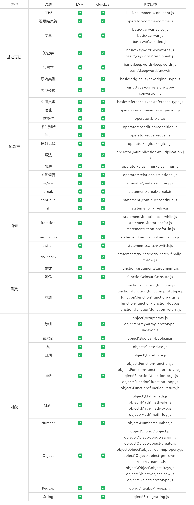
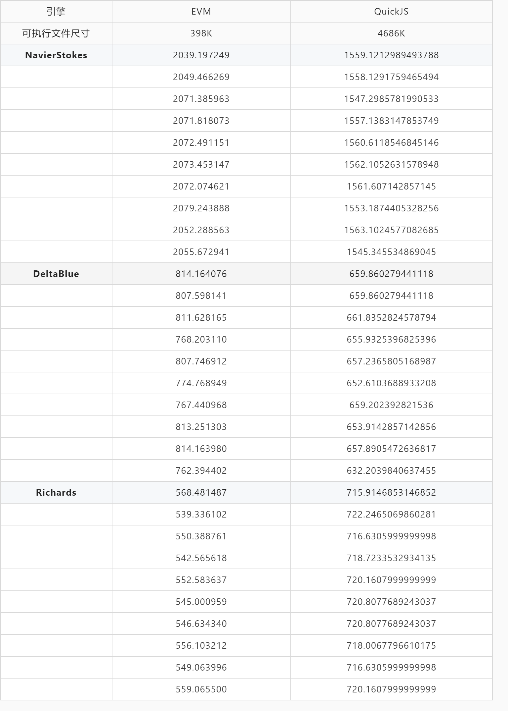
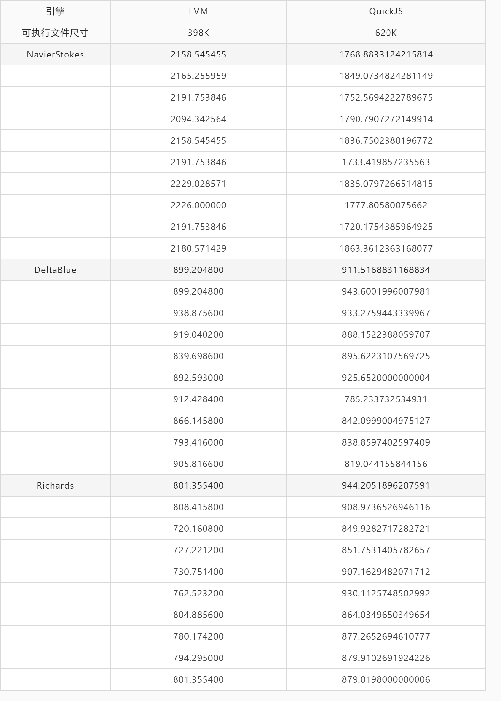

# 1. 报告概述

## 1.1 报告目的

 本文档旨在帮助用户快速的了解EVM超轻量物联网虚拟机对javascript语言的支持程度和虚拟机的性能，加深的EVM的理解和认识；

## 1.2 报告范围

 本报告对社区免费开放，欢迎社区用户体验EVM并提供宝贵的意见。

## 1.3 软件简介

 **`EVM`** 全称`Embedded Virtual Machine`，本质上是一款通用、精简的嵌入式虚拟机，由语法解析前端框架和字节码运行后端构成，可运行在资源受限制的单片机上。

## 1.4 软件版本和仓库

| 软件 | 版本 | 仓库地址 |
| --- | --- | --- |
| **EVM** | EVM内部最新版1.9 | [https://github.com/scriptiot/evm](https://github.com/scriptiot/evm) |
| **QuickJS** | QuickJS最新tag 20200705 版本 | [https://github.com/horhof/quickjs](https://github.com/horhof/quickjs) |
| **benchmark** | EVM测试仓库 1.0 | [https://github.com/scriptiot/benchmark](https://github.com/scriptiot/benchmark) |

# 2. 目录结构

| **文件** |  | **说明** |
| :---: | :---: | --- |
| **evm** | bin | windows和Linux的ejs二进制版本 |
|  | lib | windows和Linux的libejs.a 静态库 |
|  | src | ejs源码工程目录 |
| **quickjs** | bin | windows和Linux的quickjs二进制版本 |
|  | src | quickjs源码工程目录 |
| **test** | benchmark | 性能测试脚本集 |
|  | basic | 基础语法测试脚本集 |
|  | operater | 运算符测试脚本集 |
|  | statement | 语句测试脚本集 |
|  | object | 对象测试脚本集 |
|  | function | 函数测试脚本集 |
| readme.md |  | 仓库说明文件 |

# 3. 功能测试

## 3.1 测试目的

 验证EVM对javascript语法的支持程度

## 3.2 测试环境
 

| 测试环境 | 类型 | 生产商/来源 | 硬件配置 | 软件版本 |  |
| :---: | :---: | :---: | :---: | :---: | --- |
|  |  |  |  | os | gcc |
|  | 测试机-1 | 联想Air13 | 处理器：Intel i7 10710 12核 内存：16 GB 存储：1T 主频：1.61GHz | windows 10  | gcc version 7.3.0 (x86_64-posix-seh-rev0, Built by MinGW-W64 project) |

## 3.3 语法测试结果
测试脚本位于项目根目录/test下面

# 4. 性能测试

## 4.1 测试目的

 对比EVM虚拟机和QuickJs虚拟机的运行性能，为EVM的性能优化提供性能基准参考。

## 4.2 测试环境

| 测试环境 | 类型 | 生产商/来源 | 硬件配置 | 软件版本 |  |
| :---: | :---: | :---: | :---: | :---: | --- |
|  |  |  |  | os | gcc |
|  | 测试机-1 | 联想Air13 | 处理器：Intel i7 10710 12核 内存：16 GB 存储：1T 主频：1.61GHz | windows 10  | gcc version 7.3.0 (x86_64-posix-seh-rev0, Built by MinGW-W64 project) |
|  | 测试机-2 | 组装台式机 | 处理器：Intel i5-9600K 6核 内存：32 GB 存储：1T 主频：3.70GHz | windows 10 WSL (ubuntu 20.04) | None |
|  | 测试机-3 |  | 处理器：Intel i7 10710 内存：16 GB 存储：1T 主频：1.1GHz |  |  |

## 4.3 测试脚本

- 本报告中所有的测试脚本来自于 [《JavaScript 基准测试套件 Octane》](https://github.com/chromium/octane)
| 测试脚本 | 描述 | 链接地址 |
| :---: | :---: | :---: |
| **NavierStokes** |  - Main focus: _reading and writing numeric arrays._ - Secondary focus: _floating point math._  |  |
| **DeltaBlue** |  - Main focus: _polymorphism_ - Secondary focus: _OO-style programming_  |  |
| **Richards** |  - Main focus: _property load/store, function/method calls_ - Secondary focus: _code optimization, elimination of redundant code_  |  |

## 4.4 测试机-1-性能测试结果

## 4.5 测试机-2-性能测试结果

# 5. 测试结论

- EVM对es5的语法覆盖度达到90%以上，内置函数和扩展模块功能的覆盖度对应ECMA标准还有一定差距。
- 目前可支持的测试对象为Richards、Deltablue和NavierStokes。
- 基于当前测试结果，EVM虚拟机的整体性能略优于quickjs。部分测试依赖于外部扩展实现，与虚拟机本身性能相关不大。NavierStokes测试更偏向于计算和虚拟机性能的测试，EVM在该测试跑分项目表现较好。

# 6. 参考

- [https://developers.google.com/octane/benchmark#richards](https://developers.google.com/octane/benchmark#richards)
- 

