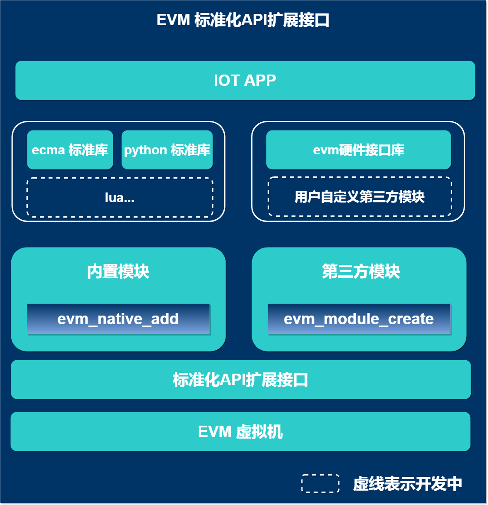

## 什么是EVM扩展模块

> EVM扩展模块是基于EVM标准化的API扩展接口实现用户第三方的扩展模块，类似nodejs的第三方模块或python的第三方模块

---

## EVM支持两种方式添加扩展模块

---

## 目前EVM支持的模块

| 模块      |    说明|
| :-------- | :--------|
| **ecma**| javascript标准库 |
| **epolling**| 任务队列库 |
| **little_qml**| 基于littlevgl的qml引擎库 |
| **evm**| evm官方提供硬件相关的的接口库 |
