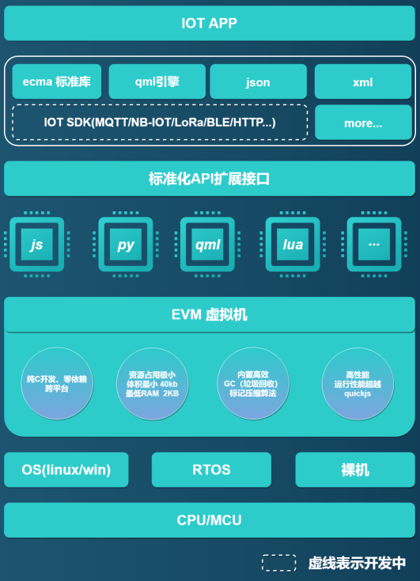

## 1. EVM是什么

 **`EVM`** 全称 `Embedded Virtual Machine`，本质上是一款通用、精简的嵌入式虚拟机，由语法解析前端框架和字节码运行后端构成，可运行在资源受限制的单片机上。

## 2. 更新内容

+ 增加对Zephyr（Linux基金会旗下开源RTOS）全面支持
+ 增加一键开发环境配置脚本evm.sh，支持windows和Linux；
+ 增加windows平台编译构建调试工具链evm-tools;
+ 增加REPL在线调试程序支持a
+ 增加物联网驱动模块evm,支持adc、dac、flash、gpio、lcd、pwm、sys、timer、uart、watchdog等驱动；
+ 增加ecma支持，支持Object、array、string、number、math、regexp；
+ 增加EVM在线帮助手册
+ 增加小熊派stm32l431开发板支持
+ 增加qemu模拟仿真cortex_m3支持，快速体验EVM
+ 增加编译时资源配置支持，允许在编译时定义系统资源，从而减少代码大小并提高性能。
+ 全新的项目目录组织架构，面向未来推出更多的模块，适配更多的RTOS和芯片开发板；

## 3. 下个版本更新计划

+ 完善EVM对zephyr的驱动支持
+ 完善ecma设计
+ 发布python3语言
+ 增加华为云组件

## 4. EVM在线帮助手册

+ [EVM在线帮助手册Gitee](http://scriptiot.gitee.io/evm_doc/#/zh-cn/evm_what)
+ [EVM在线帮助手册Github](http://scriptiot.github.io/evm_doc/#/zh-cn/evm_what)

## 6. EVM问卷调查

> **欢迎大家投票，选出你最喜欢的物联网开发语言， EVM团队会优先支持!**

[EVM支持多语言开发物联网，你最希望支持的语言是哪一种语言?](https://www.wenjuan.com/s/Qre6Vf/)

---

## 7. 加入EVM官方QQ技术交流群

> 群号：**`399011436`**

---

## 8. 贡献代码

+ 在您自己的GitHub账户下Fork **`EVM`** 开源项目；
+ 根据您的需求在本地clone 一份 **`EVM`** 代码；
+ 您修改或者新增功能后，push 到您fork的远程分支；
+ 创建 pull request，向 **`EVM`** 官方开发分支提交合入请求；
+ **`EVM`** 研发团队会定期review代码，通过测试后合入。

## 9、联系我们
========================================
+ 论坛： [EVM官方技术交流论坛](http://forum.evmiot.com/)
+ 邮箱： scriptiot@aliyun.com

欢迎大家通过 `GitHub issues`、`邮件` `论坛` 或 `QQ群`反馈问题和联系我们。
