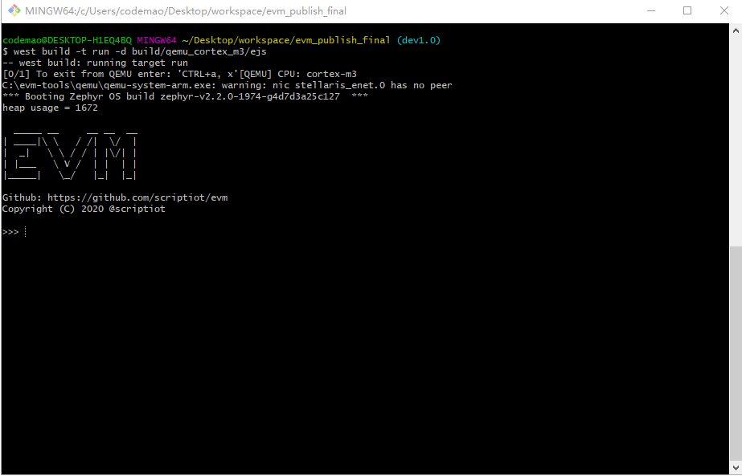

## 1. 基于Zephyr快速体验EVM

bsp目录中有一个**`qemu_cortex_m3`**的项目，用户可以快速的基于 **`Zephyr`** 构建 **`cortex_m3`** 的项目进行体验，并使用qemu进行模拟运行。

## 2. 编译qemu_cortex_m3

```sh
west build -b qemu_cortex_m3 bsp/qemu_cortex_m3/ejs -d \
build/qemu_cortex_m3/ejs
```

+ `-b` 指定board
+ `-d` 项目编译构建目录


## 3. qemu模拟器运行程序

```sh
west build -t run -d build/qemu_cortex_m3/ejs
```

