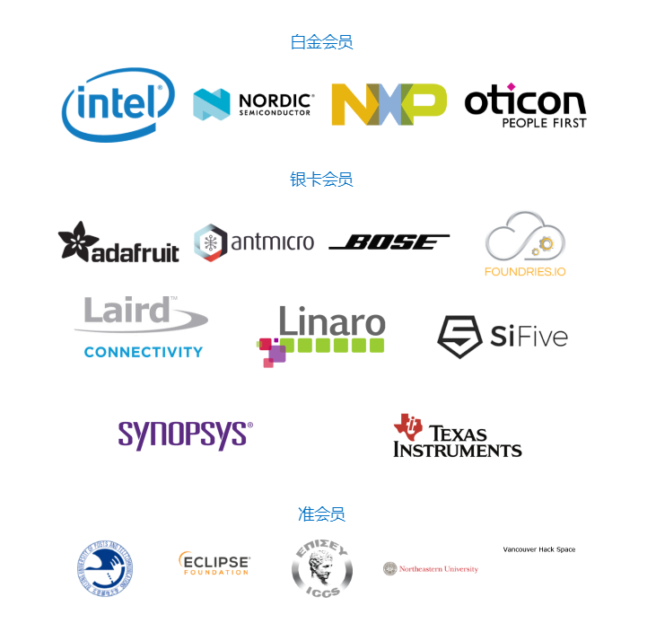

## 1. Zephyr是什么

**`Zephyr`**项目是一个Linux基金会托管的开源合作项目，联合了业内领先企业(英特尔公司、恩智浦半导体公司），为所有资源受限设备构建了针对资源受限设备进行优化的最佳小型可扩展实时操作系统（RTOS）;

**`Zephyr RTOS`**的目标是建立一个中立项目，成为针对连接的资源受限设备进行最佳优化的小型RTOS，可扩展、跨多个架构，并且考虑到安全性;

## 2. 支持架构体系

**`Zephyr`**内核支持多种架构，包括`ARM Cortex-M`，`Intel x86`，`ARC`，`NIOS II`，`Tensilica Xtensa`和`RISC-V32`;

## 3. 支持Zephyr的单位和组织

## 4. Zephy优势特点

+ 广泛的服务套件：Zephyr™操作系统为软件开发提供了许多熟悉的服务，其中包含：
  + 多线程服务 – 可以用于以优先级为基础非抢占式的纤程，以及以优先级为基础抢占式，可选轮询时间分片的任务; 
  + 中断服务 – 可以在编译中和程序运行时处理中断程序注册;
  + 线程间的同步服务 – 提供二进制信号量(Semaphore)、计数信号量、互斥信号量;
  + 用于基本消息队列，增强消息队列和字节流的线程间数据传递服务;
  + 线程间的数据传递服务 - 提供基本消息队列、增强的消息队列和字节流;
  + 电源管理服务 – 不需计数的闲置状态和先进的闲置基础架构。

+ 多种调度算法, Zephyr提供了一组全面的线程调度选择：

  + 协作式和抢先式调度
  + 最早截止日期优先（EDF）
  + 元IRQ调度实现“中断下半部分”或“ tasklet”行为
  + 时间片：启用优先级相同的可抢占线程之间的时间片
  + 多种排队策略：
    + 简单的链表就绪队列
    + 红/黑树就绪队列
    + 传统的多队列就绪队列

+ 高度可配置: 允许应用程序只包含所需的功能，并指定它们的数量和大小；

+ 跨架构支持：支持不同的CPU架构和开发工具链

+ 记忆保护

+ 编译时资源定义：允许在编译时定义系统资源，从而减少代码大小并提高性能。

+ 优化的设备驱动程序模型： 

+ Devicetree支持：使用devicetree描述硬件

+ 支持多种协议的原生网络协议栈： 网络支持功能全面且经过优化， 支持LwM2M 和 BSD sockets；同时提供了OpenThread支持（在Nordic芯片组上）：一种网状网络，旨在安全可靠地连接家庭中的数百种产品。

+ 低功耗蓝牙5.0支持： 兼容蓝牙5.0（ESR10）和蓝牙低功耗控制器支持（LE链路层）。包括BLE Mesh和支持蓝牙认证的BLE控制器。

    + 具有所有可能的LE角色的通用访问配置文件（GAP）。

    + GATT（通用属性配置文件）

    + 配对支持，包括蓝牙4.2中的“安全连接”功能

    + 干净的HCI驱动程序抽象

    + 原始HCI接口可将Zephyr作为控制器而不是完整的主机堆栈运行

    + 经过多个流行控制器的验证

    + 高度可配置

    + 网格支持：

        + 中继，Friend节点，低功耗节点（LPN）和GATT代理功能

        + 支持PB-ADV和PB-GATT

        + 高度可配置，适合具有至少16k RAM的设备

+ 原生支持Linux、MacOs和windows开发环境

+ 虚拟文件系统支持（LittleFS 和 FATFS ）

+ 强大的多后端日志记录框架：持日志过滤，对象转储，紧急模式，多个后端（内存，网络，文件系统，控制台等）以及与Shell子系统的集成。

+ 用户友好且功能齐全的Shell界面： 具有用户友好功能的多实例外壳子系统，例如自动完成，通配符，着色，元键（箭头，退格键，Ctrl + U等）和历史记录。支持静态命令和动态子命令。

+ NVS（Non-volatile storage）设置：设置子系统为模块提供了一种存储每个设备的持久配置和运行时状态的方法。设置项存储为键值对字符串。

+ NVS（Non-volatile storage）支持：NVS允许存储二进制Blob，字符串，整数，长整型以及它们的任意组合。

+ 原生POSIX支持： 支持将Zephyr作为Linux应用程序运行，并支持各种子系统和网络。

## 5. 支持开发板

[`zephyr支持200+开发板`](https://docs.zephyrproject.org/latest/boards/index.html)

+ x86 Boards
    + ACRN UOS (User Operating System)
    + Gordon Peak MRB
    + MinnowBoard Max
    + X86 Emulation (QEMU)
    + UP Squared
+ ARM Boards
    + 96Boards Aerocore2
    + 96Boards Argonkey
    + 96Boards Avenger96
    + 96Boards Carbon
    + 96Boards Carbon nRF51
    + 96Boards Meerkat96
    + 96Boards Neonkey
    + 96Boards Nitrogen
    + 96Boards STM32 Sensor Mezzanine
    + 96Boards WisTrio
    + Actinius Icarus
    + Adafruit Feather M0 Basic Proto
    + Adafruit Feather nRF52840 Express
    + Adafruit Feather STM32F405 Express
    + Adafruit Trinket M0
    + Arduino Due
    + Arduino/Genuino Zero
    + SAM D20 Xplained Pro Evaluation Kit
    + SAM D21 Xplained Pro Evaluation Kit
    + SAM E54 Xplained Pro Evaluation Kit
    + SAM R21 Xplained Pro Evaluation Kit
    + ST B-L072Z-LRWAN1 Discovery kit
    + BBC MicroBit
    + Broadcom BCM958401M2
    + Broadcom BCM958402M2 (Cortex-A72)
    + Broadcom BCM958402M2 (Cortex-M7)
    + Laird Connectivity BL652 DVK
    + Laird Connectivity BL654 DVK
    + Black STM32 F407VE Development Board
    + Black STM32 F407ZG Pro Development Board
    + CC1352R1 LaunchXL
    + CC26x2R1 LaunchXL
    + CC3220SF LaunchXL
    + CC3235SF LaunchXL
    + NXP i.MX 7 Computer on Module - Colibri iMX7
    + PSoC6 WiFi-BT Pioneer Kit (CM0+ Core)
    + PSoC6 WiFi-BT Pioneer Kit (CM4 Core)
    + Decawave DWM1001
    + Degu Evaluation Kit
    + ST Disco L475 IOT01 (B-L475E-IOT01A)
    + Dragino LSN50 LoRA Sensor Node
    + EFM32 Giant Gecko GG11 Starter Kit
    + EFM32HG-SLSTK3400A
    + EFM32 Pearl Gecko Starter Kit
    + EFM32WG-STK3800
    + EFR32 BRD4104A (SLWRB4104A)
    + EFR32 BRD4250B (SLWRB4250B)
    + EFR32 Radio Boards
    + EFR32MG-SLTB004A
    + NXP FRDM-K22F
    + NXP FRDM-K64F
    + NXP FRDM-K82F
    + NXP FRDM-KL25Z
    + NXP FRDM-KW41Z
    + Google Kukui EC
    + Hexiwear
    + Hexiwear KW40Z
    + Holyiot YJ-16019
    + SEGGER IP Switch Board
    + NXP LPCXPRESSO54114
    + NXP LPCXpresso55S16
    + NXP LPCXPRESSO55S69
    + MEC1501 Modular card ASSY6885
    + MEC15xxEVB ASSY6853
    + MEC2016EVB ASSY6797
    + Mikroe MINI-M4 for STM32
    + NXP MIMXRT1010-EVK
    + NXP MIMXRT1015-EVK
    + NXP MIMXRT1020-EVK
    + NXP MIMXRT1050-EVK
    + NXP MIMXRT1060-EVK
    + NXP MIMXRT1064-EVK
    + MadMachine SwiftIO
    + ARM V2M MPS2
    + ARM MPS2+ AN521
    + MSP-EXP432P401R LaunchXL
    + Waveshare BLE400
    + Redbear Labs Nano
    + nRF51-VBLUno51
    + nRF51 DK
    + nRF51 Dongle
    + nRF52832-mdk
    + nRF52820 emulation on nRF52833 DK
    + nRF52833 DK
    + Electronut Labs Blip
    + nRF52840-mdk
    + Electronut Labs Papyr
    + nRF52811 emulation on nRF52840 DK
    + nRF52840 DK
    + nRF52840 Dongle
    + nRF52 Adafruit Feather
    + Redbear Labs Nano v2
    + nRF52-VBLUno52
    + nRF52810 emulation on nRF52 DK
    + nRF52 DK
    + nRF5340 PDK
    + nRF9160 INNBLUE21
    + nRF9160 INNBLUE22
    + nRF9160 DK - nRF52840
    + nRF9160 DK
    + ST Nucleo F030R8
    + ST Nucleo F070RB
    + ST Nucleo F091RC
    + ST Nucleo F103RB
    + ST Nucleo F207ZG
    + ST Nucleo F302R8
    + ST Nucleo F303RE
    + ST Nucleo F334R8
    + ST Nucleo F401RE
    + ST Nucleo F411RE
    + ST Nucleo F412ZG
    + ST Nucleo F413ZH
    + ST Nucleo F429ZI
    + ST Nucleo F446RE
    + ST Nucleo F746ZG
    + ST Nucleo F756ZG
    + ST Nucleo F767ZI
    + ST Nucleo G071RB
    + ST Nucleo G431RB
    + ST Nucleo G474RE
    + ST Nucleo H743ZI
    + ST Nucleo L053R8
    + ST Nucleo L073RZ
    + ST Nucleo L152RE
    + ST Nucleo L432KC
    + ST Nucleo L452RE
    + ST Nucleo L476RG
    + ST Nucleo L496ZG
    + ST Nucleo L4R5ZI
    + ST Nucleo L552ZE Q
    + ST Nucleo WB55RG
    + OLIMEX-STM32-E407
    + OLIMEX-STM32-H407
    + OLIMEX-STM32-P405
    + OLIMEXINO-STM32
    + Particle Argon
    + Particle Boron
    + Particle Xenon
    + Pico-Pi i.MX7D - Android Things IoT Development Platform
    + ARM Cortex-A53 Emulation (QEMU)
    + ARM Cortex-M0 Emulation (QEMU)
    + ARM Cortex-M3 Emulation (QEMU)
    + ARM Cortex-R5 Emulation (QEMU)
    + reel board
    + SAM4E Xplained Pro
    + SAM4S Xplained
    + SAM E70(B) Xplained
    + SAM V71(B) Xplained Ultra
    + ST SensorTile.box
    + ST STM32 Flight Controller Unit
    + ST STM3210C Evaluation
    + ST STM32373C Evaluation
    + STM32 Minimum Development Board
    + STM32F030 DEMO BOARD
    + ST STM32F072 Evaluation
    + ST STM32F072B Discovery
    + ST STM32F0 Discovery
    + ST STM32F3 Discovery
    + ST STM32F411E Discovery
    + ST STM32F412G Discovery
    + ST STM32F429I Discovery
    + ST STM32F469I Discovery
    + ST STM32F4 Discovery
    + ST STM32F723E Discovery
    + ST STM32F746G Discovery
    + ST STM32F769I Discovery
    + ST STM32G0316 Discovery
    + ST STM32H747I Discovery
    + ST STM32L1 Discovery
    + ST STM32L476G Discovery
    + ST STM32L496G Discovery
    + ST STM32MP157C-DK2 Discovery
    + ST STM32VL Discovery
    + Thingy:52
    + NXP TWR-KE18F
    + NXP TWR-KV58F220M
    + UDOO Neo Full
    + NXP USB-KW24D512
    + ARM V2M Beetle
    + ARM V2M Musca
    + ARM V2M Musca B1
    + WaRP7 - Next Generation IoT and Wearable Development Platform
    + INFINEON XMC45-RELAX-KIT
+ ARC Boards
    + DesignWare(R) ARC(R) EM Starter Kit
    + DesignWare(R) ARC(R) EM Software Development Platform
    + DesignWare(R) ARC(R) HS Development Kit
    + DesignWare(R) ARC(R) IoT Development Kit
    + DesignWare(R) ARC(R) Emulation (nsim)
+ NIOS II Boards
    + Altera MAX10
    + Altera Nios-II Emulation (QEMU)
+ XTENSA Boards
    + ESP32
    + Intel S1000 CRB
    + ODROID-GO
    + Xtensa Emulation (QEMU)
    + Up Squared Audio DSP
    + Xtensa simulator
    + POSIX/NATIVE Boards
    + Native POSIX execution (native_posix)
    + NRF52 simulated board (BabbleSim)
+ RISCV Boards
    + SiFive HiFive1
    + SiFive HiFive1 Rev B
    + LiteX VexRiscv
    + Microsemi M2GL025 Mi-V
    + RISCV32 Emulation (QEMU)
    + RISCV64 Emulation (QEMU)
    + OpenISA VEGAboard
+ Shields
    + Adafruit 2.8” TFT Touch Shield v2
    + BOOSTXL-ULPSENSE: Ultra-low Power Sensor BoosterPack
    + DFRobot CAN BUS Shield V2.0
    + ESP-8266 Modules
    + NXP FRDM-CR20A
    + NXP FRDM-KW41Z Shield
    + PHYTEC link board ETH
    + LMP90100 Sensor AFE Evaluation Board
    + MikroElektronika ADC Click
    + SSD1306 128x64(/32) pixels generic shield
    + Generic ST7789V Display Shield
    + WAVESHARE e-Paper Raw Panel Shield
    + X-NUCLEO-IDB05A1: BLE expansion board
    + X-NUCLEO-IKS01A1: MEMS Inertial and Environmental Multi sensor shield
    + X-NUCLEO-IKS01A2: MEMS Inertial and Environmental Multi sensor shield
    + X-NUCLEO-IKS01A3: MEMS Inertial and Environmental Multi sensor shield
    + X-NUCLEO-IKS02A1: MEMS Inertial and Environmental Multi sensor shield

